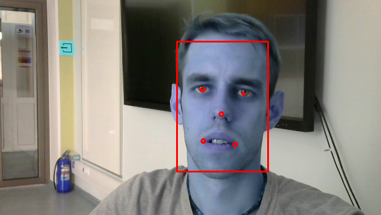
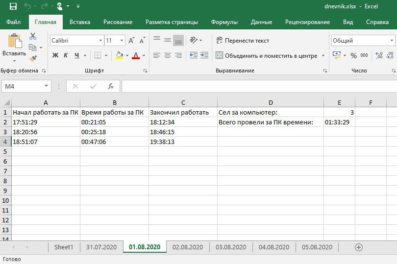
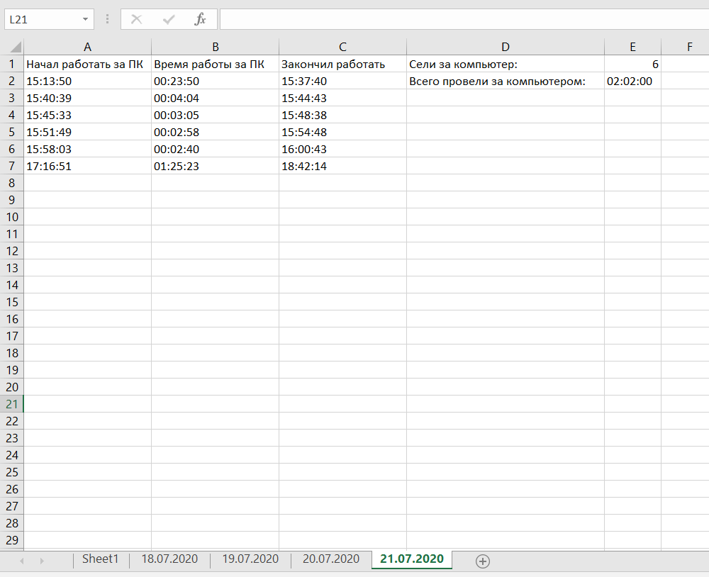

# Chasovoy. Приложение по мониторингу работы за компьютером и введению статистики
Используется python 3.6. Приложение подсчитывает время, проведенное за компьютером, ведет статистику в excel и выдает звуковое оповещение о том, что пора сделать перерыв.

Слежение за человеком осуществляется через web камеру с помощью библиотеки mtcnn.

  

Статистика ведется в документе dnevnik.xlsx. Программа каждый день создает новый лист с текущей датой, в который заносится информация о проведенном времени за ПК. Функция `write_excel` делает запись каждый раз, когда посещение за компьютером превышает минимально заданное время (переменная min_time).

  

На 1 листе записывается посуточная информация, в какой день сколько времени провели за компьютером.

  

Функция `audio_message` отвечает за звуковое оповещение, о необходимости сделать перерыв. В папке audio хранятся wav файлы, которые выбираются рандомным образом.

Задержка `cv2.waitKey(300)` обусловлена экономией вычислительной мощности (для слабого компьютера). Для работы программы достаточно обработки нескольких кадров в секунду.

Для того, чтобы скрипт загружался вместе с windows создайте бат файл с запуском скрипта и поместите этот батник в папку `C:\Users\%UserName%\AppData\Roaming\Microsoft\Windows\Start Menu\Programs\Startup`
