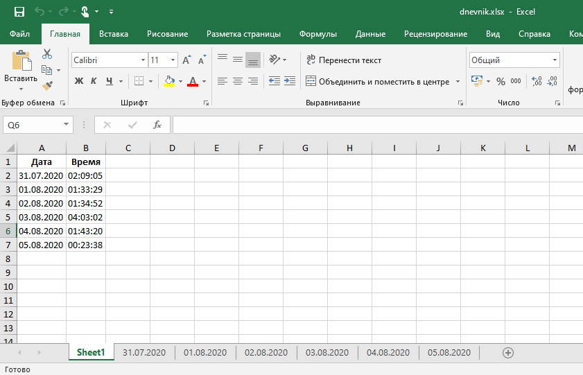

# Chasovoy. Приложение по мониторингу работы за компьютером и введению статистики
Используется python 3.6. Приложение подсчитывает время, проведенное за компьютером и ведет статистику в excel.

Детекция лица осуществляется с помощью библиотеки mtcnn.

  

Статистика ведется в документе log.xlsx который необходимо создать перед запуском программы. Каждый день создается новый лист с текущей датой, в который заносится информация о проведенном времени за ПК. Запись в журнал производится, когда посещение за компьютером превышает минимально заданное время (переменная `min_time_work`).

Каждый день программа создает новый лист с текущей датой.

  

На 1 листе записывается посуточная информация, в какой день сколько времени провели за компьютером.

  

Задержка `cv2.waitKey(800)` обусловлена экономией вычислительной мощности компьютера. Для работы программы достаточно обработки нескольких кадров в секунду.

Для того, чтобы скрипт загружался вместе с windows создайте бат файл с запуском скрипта и поместите этот батник в папку `C:\Users\%UserName%\AppData\Roaming\Microsoft\Windows\Start Menu\Programs\Startup`
